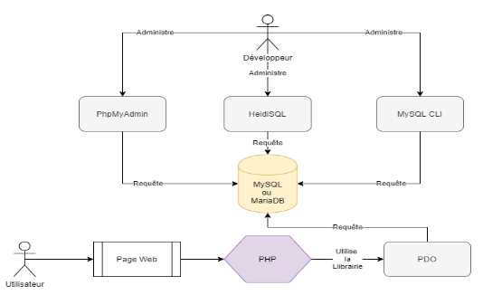

# Vanilla-Back-PDO

# 💾 PDO Connexion BDD



# 🏆 Objectifs

- Je sais connecter mon site avec ma base de données (BDD)
- Je sais récupérer et lire les données de ma BDD
- Je sais écrire et insérer des données dans ma BDD

# Différences entre PDO, MySQL, PhpMyadmin

**MySQL** et **MariaDB** sont deux systèmes de base de données relationnelle concurrents.

MariaDB a été conçu par des anciens fondateurs de MySQL,[ pour diverses raisons](https://subscription.packtpub.com/book/application_development/9781783981601/1/ch01lvl1sec08/mariadb-history).

Ce sont donc des **serveurs** de base de données, qui ouvrent leurs portes pour que d'autres logiciels puissent envoyer des requêtes et recevoir des données en retour.

PhpMyAdmin, HeidiSQL, MySQL CLI, et bien d'autres logiciels du genre ont tous le point commun d'être des **clients** permettant d'envoyer au serveur des requêtes SQL.

Sans **client**, il n'est pas possible d'interroger un serveur SQL.

PDO part du même principe mais au lieu de pouvoir être utilisé via une interface graphique, c'est sous forme de code PHP que l'on acquiert la possibilité de faire des requêtes.

# 🎦 Live coding

<details>
  <summary>Le fichier connexion.php</summary>
  
  ```php
  <?php

     // le try catch, permet d'essayer un bout de code, et si il détecte le moindre problème il nous retourne une exception
     // on peut traiter cette exception pour avoir un message d'erreur détaillé
     try
     {
          // je crée une variable $db, qui va contenir l'accès à ma base de donnée.
          // cette variable va contenir l'objet PDO (nous verrons ce qu'est un objet plus tard dans la formation,
          // pour l'instant ça ne vous sea pas utile)
          // pour crée cette connexion il va vous falloir plusieurs parties :

          // le dns, qui va correspondre à la base de donnée que l'on utilise, ici mysql
          // suivi de l'hote après host=, ici localhost
          // suivi du nom de la base de donnée après "dbname="
          $dns = 'mysql:host=localhost;dbname=pdo_test';


          // le nom d'utilisateur, utilisé dans la base de donnée, oar défaut sur wampserver c'est 'root'
          $user = 'root';

          // le mot de passe utilisé sur votre base de donnée
          $password = '';

          $db = new PDO( $dns, $user, $password);
     }
     catch (Exception $message){
          // dans le cas où la connexion à la base de donnée serait mal executé (par exemple un mauvais nom d'utilisateur)
          // vous pouvez utiliser l'objet Exception pour afficher un message d'erreur personnalisé comme ci-dessous
          echo "ya un blem <br>" . "<pre>$message</pre>" ;
     }


     ?>

````
</details>

<details>
  <summary>Récupération d'un User en Base de Donnée</summary>

  ```php
  <?php
     // dans un nouveau fichier que l'on peut nommer index.php
     // ne pas oublier d'importer le fichier connexion.php où l'on créer la connexion PDO
      require_once('connexion.php');

      // requete de mon user :

      // on commence par préparer la requète grace à query()
      $request =  $db->query('SELECT * FROM user');

      // on récupère la réponse à la requète grâce à fetch(), car je n'ai qu'un seul user en BDD
      $user = $request->fetch();


     // après avoir récupéré la réponse de votre requète, ne pas hésiter à contrôler les données que l'on reçoit
     // par exemple pour voir le type de donnée que l'on reçoit
      var_dump($user);

     // grâce à mon var_dump précédent, j'ai vu que la donnée que je reçois dans $user est un tableau, et il a une colonne nommée prenom.
     // je décide donc d'afficher sur ma page html ce prénom
      echo($user['prenom']);

     ?>

````

</details>

<details>
  <summary>Récupération de plusieurs product en Base de Donnée</summary>

```php
<?php
   // requete de mes produits

   // on prépare la requète
   $request = $db->query('SELECT * FROM product');

   // on récupère la réponse à la requète grâce à fetchAll(), car j'ai plusieurs produits en BDD
   $products = $request->fetchAll();

   // ce var_dump me montre que je reçois un tableau, dans lequel il y a plusieurs tableau, un tableau pour chaque produit.
   var_dump($products);

   // pour afficher le nom de chacun des produits, je boucle dans ce grand tableau. Pour chaque produit :
   foreach($products as $product){
        // j'affiche la colonne name du tableau d'UN produit
        echo($product['name']. '<br><hr><br>');
   }

   ?>

```

</details>

# 📖 Le cours de référence

Voici les 2 chapitres OpenClassroom qui regroupent l'ensemble de la théorie sur la requête PDO, la préparation de requête et l'exécution des requêtes

- [Lire des données MySQL avec PHP](https://openclassrooms.com/en/courses/918836-concevez-votre-site-web-avec-php-et-mysql/914293-lisez-des-donnees)
- [Ecrire des données SQL avec PHP](https://openclassrooms.com/en/courses/918836-concevez-votre-site-web-avec-php-et-mysql/914508-ecrivez-des-donnees)
- la doc PDO →[ PHP: PDO - Manual](https://www.php.net/manual/fr/book.pdo.php)

# ⛳ Exercices 1

##

**Pour faire ces exercices, vous devez utiliser le code SQL qui vous est fourni pour créer la BDD.**

Utilisation de PDO pour récupérer, lire et afficher des données

- [simplon-roanne/Exercice-PDO-1](https://github.com/simplon-roanne/Exercice-PDO-1)

# ⛳ Exercices 2

##

**Pour faire ces exercices, vous devez utiliser le code SQL qui vous est fourni pour créer la BDD.**

Ecriture et lecture de données ( Hospital ) :

- [simplon-roanne/Exercice-PDO-2](https://github.com/simplon-roanne/Exercice-PDO-2)
